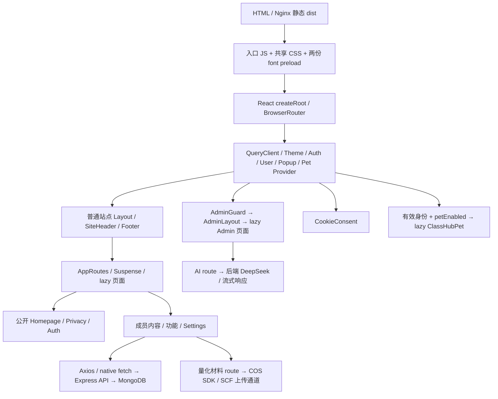

# ClassHub Performance Audit

审计日期：2026-10-05（Asia/Shanghai）  
项目：`/Users/alexmason/Desktop/uniclub-main`  
线上：<https://csrg3b.top/>  
范围：全站源码与 production bundle；访客首页的本地 production / 线上冷启动实测。  
原则：**ZERO FUNCTIONAL CHANGES。只测量、分析与记录；本轮没有实施任何优化。**

证据标识：**MEASURED** = 文件/响应/trace 实测；**SOURCE-CONFIRMED** = 当前源码确认；**UNVERIFIED** = 没有可靠运行测量，不能据此认定用户卡顿。容量统一使用 B、KiB（1024 B）、MiB（1024² B）；网络 transfer 包含响应头，离线 gzip/br 不包含响应头。

## 01 Executive Summary

**当前最明显的问题是首次访问下载负担和首页加载链，其次是加载阶段的布局位移。** 线上移动限速时，访客首页传输 1,521,868 B（1.45 MiB），FCP 4.77 s、LCP 7.10 s；同一次 trace 的 TBT 只有 14 ms。现在的证据支持先处理资源和首屏建立过程。

| 类别 | 评级 | 依据与边界 |
| --- | --- | --- |
| STARTUP | **D** | 审计内部评级：移动端实际限速 LCP 6.94–7.10 s；桌面 CLS 0.626，移动 CLS 0.153。D 表示实测冷启动存在明显问题，非 Lighthouse 分数映射。 |
| NAVIGATION | **UNVERIFIED / 未评级** | 路由已拆分，但没有成员态页面切换计时、真实 API waterfall 与交互 trace。不能从 chunk 小就推导切页流畅。 |
| INTERACTION | **UNVERIFIED / 未评级** | 搜索状态局部化、200 ms debounce 已确认；没有可信 input latency、INP 和 React commit 计数。 |
| ANIMATION | **UNVERIFIED / 未评级** | 已检查动画实现和清理；没有物理移动设备、成员态桌宠的 FPS / dropped frame 实测。 |

### TOP 5 BOTTLENECKS

1. **P1 · STARTUP：页眉 Logo 明显过大。** Impact: HIGH。单个 PNG **567,620 B**，2172×724，手机显示约 184 px 宽；线上实际限速下载持续 **5.94 s**，约占首页 transfer 的 37%。它不是本次 LCP 元素，但确实占用首页带宽，并让品牌图很晚完成。
2. **P1 · STARTUP：首屏字体下载量。** Impact: HIGH。移动端 4 个字体 **545,612 B**，桌面 7 个 **635,988 B**；其中 HTML 提前 preload 的两份共 **324,892 B**。并非一次下载全部中文字体，但当前 core 与首屏字符组合仍重。
3. **P1 · STARTUP：首页加载占位与真实页面高度不同。** Impact: HIGH。桌面 **CLS 0.626**，移动 **0.153**；trace 显示 Suspense 的短内容被 Homepage 替换时，页脚从可见区域被推走。
4. **P1 · STARTUP：共享入口 JS 与第二阶段首页加载。** Impact: HIGH（下载与内容出现延迟）。入口 raw **552,090 B**，线上 gzip body **219,437 B**；首页总共 15 个 JS 请求。主入口完成后才开始首页 chunk，线上限速约 4.67 s 才 DCL、约 6.59 s 首页中文字体才被发现。没有证据表明这里存在秒级 JS 执行阻塞。
5. **P1 · STARTUP：共享 CSS 内包含全部字体 face 元数据。** Impact: HIGH（渲染阻塞）。共享 CSS raw **363,141 B**，线上 gzip body **119,259 B**；其中 **291 个 @font-face 共 243,071 B raw**。这与第 2 项的字体二进制是不同请求，收益不能重复相加。

以上按已观察到的资源负担、关键链路和布局稳定性排序，不按实现难度排序。字体、JS、CSS 共用带宽，排序不是逐项 A/B 因果消融结果，不能承诺各项节省时间可线性累加。**未发现有实测证据支持的 P0。**

**目前不是访客首屏瓶颈：** AI 后台、COS 上传 SDK、Markdown renderer、随机点名名单、桌宠引擎/图片/音频都未在该首屏请求；Recharts 和 react-big-calendar 未出现在生产模块清单；线上静态 HTML 未限速 TTFB 约 153 ms。

## 02 Current Architecture



- React 18.3.1、React Router 6、Vite 5.4.19、TypeScript 5.9.3；`src/main.tsx` 使用 `createRoot`。这是 **CSR，无 SSR hydration**。
- React Query 5 管服务端缓存；Auth/User/Popup 使用 context；Pet/账号偏好使用共享 observable store。
- HTTP 使用 `src/lib/axios.ts` 与部分 native fetch；CSS 是 Tailwind + `tokens.css` + 语义 CSS 与各 route CSS。
- 字体本地自托管，`editorial.css` 引入 `/fonts/classhub/fonts.css`；Vite 将它合并到共享 CSS。
- 页眉形变/Home reveal/list Flip 使用 GSAP；typing 为局部 React timeout；桌宠为 DOM imperative engine。
- `src/routes.tsx` 包括公告、新闻、活动、资源、动态、功能、随机点名、设置、班费、量化材料、登录和各 Admin 子页，全部页面入口使用 `React.lazy`。
- Auth guard 继续保护内部内容；访客首页分支不请求班级数据。主题当前强制浅色，不将历史 dark CSS 当作第二套首屏字体请求。
- 仓库有 `deploy/ecs/nginx.conf`、`nginx-https.conf`、发布脚本、systemd 服务文件及 Docker/Mongo 配置；线上为 Nginx 静态资源 + Express 5050。未 SSH 登录、未修改服务端配置。

## 03 Measurement Environment

| 项目 | 设置 |
| --- | --- |
| OS / Node | macOS 27.2（26B5091g）；Node 26.7.0，darwin arm64 |
| 构建 | 现有 `npm run build`，包含 app/node TypeScript typecheck；不是 dev bundle |
| 工具 | Lighthouse 13.5.0，Chrome 154.0.0.0；临时 npx 使用，不修改 dependencies |
| 本地测量站点 | `http://127.0.0.1:9189/`，临时静态服务直接读取正式 `dist/`；gzip level 1，匹配线上 JS/CSS 的压缩体积；不使用 8081 dev 的性能代替 production |
| Desktop 模拟 | 1350×940，DPR 1；RTT 40 ms，吞吐 10,240 Kbps，CPU 1× |
| Mobile 模拟 | 390×844，DPR 1；Moto G Power UA；RTT 150 ms，吞吐 1638.4 Kbps，CPU 4×；Lighthouse Lantern 模拟 |
| Mobile 实际限速 | 同一 viewport/UA；DevTools request latency 562.5 ms，下载 1474.56 Kbps、上传 675 Kbps，CPU 4× |
| 会话 | 独立 Chrome profile，冷缓存、Guest、无登录 token、无 cookie consent record |
| 次数 | 6 次：local/online 各 desktop simulate、mobile simulate、mobile DevTools 实际限速 |
| 未控制变量 | 机器后台任务、真实手机 GPU/功耗；硬件 CPU 型号/RAM 未成功获取，UNVERIFIED |

两种限速方法不同，**不能将模拟与实际限速混成平均值**。Desktop 的 DCL/Load 来自原始 trace；其 FCP/LCP 来自模拟模型，两组时钟含义不同。较早 desktop/mobile 模拟运行使用 disable-gpu，后续实际移动限速没有此 flag；不据此评价 GPU 动画帧率。

## 04 Production Build Summary

- **PASS**：`npm run build` 与包含的两份 typecheck。
- 命令总 wall time **5.35 s**，其中 Vite **2.23 s**；转换 **2977 modules**。
- 构建警告：入口超过 Vite 500 kB 警戒值；Browserslist 数据提示 24 个月未更新。本轮只记录，没有更新依赖。
- dist **672 文件 / 89,894,103 B（85.73 MiB）**。这是部署目录体积，不是用户首次下载体积。

| dist 类型 | 文件数 | Raw B | 离线 gzip B | 离线 Brotli B（quality 5） |
| --- | ---: | ---: | ---: | ---: |
| JS | 88 | 1,406,199 | 485,912 | 452,711 |
| CSS | 10 | 842,450 | 254,161 | 140,973 |
| HTML | 1 | 2,198 | 966 | 793 |
| WOFF2 | 494 | 35,295,736 | 已压缩格式，不作为再 gzip 优先项 | 同左 |
| PNG | 41 | 26,420,243 | 未重新压缩图片 | — |
| JPG | 15 | 24,273,829 | 未重新压缩图片 | — |
| WEBP | 5 | 1,047,156 | 未重新压缩图片 | — |
| JSON | 2 | 265,458 | 95,438 | 54,962 |
| MP3 | 6 | 306,341 | 已压缩格式 | — |
| TXT / MD / 无扩展名 | 10 | 34,493 | 非首屏关键项 | — |
| 独立 SVG / source map / 视频 / AVIF / GIF / OTF / TTF | 0 | 0 | — | — |

8 个本地插画 SVG 经 Vite 内联到代码/data URI，不会出现独立 `.svg` 网络请求。全部 CSS 统计包含 copied public 字体 CSS 等未请求文件，不等于 initial CSS。桌宠目录是上述资源的子集：**39 文件 / 4,117,994 B（3.93 MiB）**，不要重复相加。

## 05 Bundle Analysis

### Initial JS 的三个口径

| 范围 | Raw B | 离线 gzip level 6 B | 离线 br q5 B | 线上实际 transfer B |
| --- | ---: | ---: | ---: | ---: |
| 入口 `static/index-2Hi7j8V9.js` | 552,090 | 191,195 | 177,204 | 219,878（其中 gzip body 219,437） |
| 访客首页入口 + 静态依赖闭包 | **601,508** | **211,601** | **195,968** | **248,245 / 15 JS 请求** |
| 全站所有 JS | 1,406,199 | 485,912 | 452,711 | 未全部下载 |

入口只有一个初始 JS chunk，随后 `React.lazy` 请求 Homepage 与 13 个依赖 chunk。code splitting 已存在；问题是共享入口较重，以及首页完成需第二阶段资源。

### 入口 package 归因

以下是 Rollup 的 **renderedLength（压缩前保留模块代码）**，用于查 import 来源；不能当作各包的网络 gzip 大小，也不能相加到 minified raw 再比较。临时 generateBundle hook 在最终 preload helper 注入前拿到代码，故其 entry snapshot 548,267 B 不用于本报告实际容量；最终以 dist 的 552,090 B 为准。

| Package | 保留模块 B | 首屏 import 来源 / 判断 |
| --- | ---: | --- |
| gsap | **439,075** | `main.tsx:8 → lib/gsap.ts` 全局注册 core / ScrollTrigger / Flip；页眉需要 core，Home 使用 ScrollTrigger，Flip 实际由列表页 `useFlipList` 使用 |
| react-dom | 134,039 | React 运行时，必要 |
| axios | 97,124 | 多个全局 context 与 API client；含通用 adapter，当前浏览器无需所有分支 |
| tailwind-merge | 72,004 | `cn` utility / UI controls；共用配置体积，不是业务数据 |
| @tanstack/query-core | 48,263 | App QueryClient，必要 |
| @remix-run/router | 29,304 | Router 基础设施 |
| @radix-ui/react-dialog | 28,726 | Layout 的全局 Search / UserProfile / Avatar modal 依赖 |
| react-remove-scroll | 28,241 | 上述 dialog 的滚动管理 |
| @capacitor/core | 21,954 | `App → initializeMobileFeatures`；web 上立即 return，但 package 代码已进入入口 |
| @radix-ui/react-focus-scope | 21,682 | 全局 dialogs |
| react-router | 20,816 | Router |
| @radix-ui/react-dismissable-layer | 20,645 | 全局 dialogs |
| cmdk | 12,809 | SearchDialog，非首次渲染必需 |
| lucide-react | 7,858 | 实际 icon modules；不是整库图标都进入入口 |

**Should NOT be required for Guest initial render，但当前已进共享入口：**

- **Flip + utils/matrix：64,184 B rendered**；`src/lib/gsap.ts` 统一导出/注册，`useFlipList` 位于公告/新闻 route。不是说全部 GSAP 都可去掉。
- SearchDialog 与 cmdk/dialog 依赖：SearchDialog 本身 6,098 B rendered；打开前无需业务搜索渲染。Radix 也被 profile/其他全局 modal 共用，不能把 package 全部容量重复归给 Search。
- UserProfile / AvatarManagementModal / 上传相关 UI：AvatarManagementModal 4,501 B rendered；Guest 无法打开成员资料，但 Layout 静态 import 保留这些模块。
- Capacitor runtime 与入口插件：web 没有 native 初始化动作，但约 22 KiB core rendered 留在入口。
- `Illustration.tsx` 的共享 illustration map 把 8 个 SVG 都保留；fees 图约 4,006 B，random-call 等不必在 Guest Home 使用。属于小额入口负担，不是首要瓶颈。

### 大型功能是否污染首屏

| 模块 | 首页加载？ | 实际位置 / 结论 |
| --- | --- | --- |
| Admin 页面 | 否 | lazy AdminGuard / AdminLayout / 子页，PASS |
| AI Assistant | 否 | `AdminAi-*.js` raw 151,475 / gzip 49,198 B，PASS |
| Markdown family | 否 | react-markdown/unified/remark 在 AI route；`react-markdown` 自身 7,212 B rendered，PASS |
| Settings 页面 | 否 | `SettingsPage-*.js` raw 30,809 / gzip 10,645 B；共享 account/pet config 留在入口，页面本体 lazy，PASS |
| RandomCall / Zod | 否 | `RandomCallPage-*.js` raw 63,169 / gzip 16,359 B；Zod 147,301 B rendered 在该 route |
| Pet Engine | 否 | `ClassHubPet-*.js` 懒加载；只有登录且开启桌宠才实例化，PASS |
| COS SDK | 否 | `QuantificationPage-*.js` raw 184,000 / gzip 54,938 B；COS 自身 438,542 B rendered 在该 chunk，PASS 首屏隔离 |
| SCF 上传 client | 否（页面通道逻辑） | 随量化材料 route；未观察 Guest 上传请求 |
| Recharts / react-big-calendar | 否 | 虽在 package.json，生产 bundle module inventory 无这两个 package，PASS tree shaking / 未使用 |
| Sharp 图片处理 | 否 | 后端 utility，不在前端 bundle，PASS |

未发现同一 module ID 重复编入不同 chunk；这不等价于对所有不同版本依赖做了运行语义去重。没有部署 source maps 文件，故没有 `.map` 带宽问题；同时 Long Task 无法精确映射压缩入口内单个函数，只能结合 import graph 与 trace 分组。

## 06 Route / Code Splitting

所有页面入口均 lazy。表中 **Additional** 是“共享 entry 尚已加载，目标 route 所需静态闭包的新增 JS”；CSS、fonts、API 不计。Cold total = entry + Additional。实际从 Home 跳转时已有共享卡片 chunk，通常小于这里的 Additional；不是实测 navigation latency。

| Route | 主 route chunk | 主 chunk raw B | Additional JS raw B | Additional gzip6 B | Cold JS total gzip6 KiB | Lazy |
| --- | --- | ---: | ---: | ---: | ---: | --- |
| / | `Homepage-CnIbgDWm.js` | 19,024 | 49,418 | 20,406 | 206.64 | 是 |
| /announcements | `AnnouncementsPage-BKYl0MXh.js` | 1,521 | 20,676 | 9,496 | 195.99 | 是 |
| /news | `NewsPage-CS3DVdxz.js` | 1,676 | 25,617 | 11,500 | 197.94 | 是 |
| /events | `EventsPage-BdAIelSz.js` | 33,726 | 57,340 | 20,348 | 206.58 | 是 |
| /resources | `ResourcesPage-4NLa443s.js` | 2,229 | 28,697 | 13,175 | 199.58 | 是 |
| /social | `SocialPage-F69PYujK.js` | 15,799 | 103,042 | 37,065 | 222.91 | 是 |
| /functions | `FunctionsPage-BKDJE8v1.js` | 2,774 | 4,114 | 2,149 | 188.81 | 是 |
| /functions/random-call | `RandomCallPage-DagGJEeb.js` | 63,169 | 74,606 | 20,889 | 207.11 | 是 |
| /settings | `SettingsPage-D03R5A3g.js` | 30,809 | 66,830 | 22,096 | 208.29 | 是 |
| /fees | `FeesPage-C1vw75Oj.js` | 4,678 | 32,624 | 12,767 | 199.18 | 是 |
| /auth | `AuthPage-Cvlpk9kR.js` | 4,843 | 4,843 | 2,424 | 189.08 | 是 |
| /quantification | `QuantificationPage-DY2Ampac.js` | 184,000 | 201,408 | 62,386 | 247.64 | 是 |
| /privacy | `PrivacyPage-DztZiYnU.js` | 3,595 | 4,058 | 2,338 | 189.00 | 是 |
| /news/:id /article/:id | `ArticlePage-Ctfc-CHD.js` | 5,175 | 25,233 | 10,473 | 196.94 | 是 |
| /event/:id | `EventDetailPage-BqwXbcJj.js` | 4,610 | 25,870 | 10,958 | 197.42 | 是 |
| /resource/:id | `ResourceDetailPage-BleFx9ie.js` | 3,675 | 24,675 | 10,581 | 197.05 | 是 |
| /comments/:type/:id | `CommentsPage-Bu8mxqw2.js` | 11,877 | 92,496 | 32,647 | 218.60 | 是 |
| /admin | `AdminDashboard-BFURJLkj.js` | 3,539 | 30,238 | 11,951 | 198.38 | 是 |
| /admin/ai | `AdminAi-T6xloTfA.js` | 151,475 | 212,862 | 71,466 | 256.50 | 是 |
| /admin/quantification | `AdminQuantification-DtoOqj0T.js` | 23,717 | 68,108 | 26,177 | 212.28 | 是 |

Admin 行使用 Guard + Layout + Page 闭包去重后计算；不能只看 AdminAi 自身 chunk。各 route 的精确依赖列表见证据 `routes.json`。Auth/Layout guard 没通过时，这些内部页面组件不会正常挂载请求内部内容。

**PASS：**没有把 Admin、AI、Settings、RandomCall、COS 页面的代码统一塞进 main。**需关注：**许多很小的 icon/helper chunk（例如 play 303 B、pin 515 B）使 Home 需要 15 次 JS 请求；当前 HTTP/1.1 下后续发现/排队成本存在，但尚无 HTTP/2 对照实验，不能承诺只改协议就解决 LCP。

## 07 Font Audit

### 当前实际字体

| Font / 项目族名 | 格式 / 真实 weight | 文件数 / 总量 | Core B | Initial load / Above fold | 判定 |
| --- | --- | ---: | ---: | --- | --- |
| Source Han Sans SC / ClassHub Han Sans | WOFF2 variable 250–900 | 130 / 9,928,980 B | **261,916**（923 chars） | preload；导航、登录、Cookie、UI | 重要启动负担 |
| Source Han Serif SC / ClassHub Han Serif | WOFF2 variable 250–900 | 135 / 13,401,628 B | **192,524**（490 chars） | Home 中文引言和栏目标题按需发现；不 preload | 重要启动负担 |
| Schibsted Grotesk / ClassHub Grotesk | WOFF2 variable 400–900 | 1 / 62,976 B | **62,976**（462 chars） | preload；英文 Hero / Latin / 数字 | 有实际首屏用途 |
| Smiley Sans / ClassHub Pulse | WOFF2，真实 400 单字重 | 25 / 1,290,380 B | **1,312**（4 chars） | 本次 Guest Home **0 请求** | 不是该首屏瓶颈 |
| 其他历史字体（Noto、Geist Mono 等） | 本地 WOFF2 | 203 / **10,611,772 B** | 不适用 | 本次首页 **0 请求** | 部署体积；不是已测启动负担 |

ClassHub 四族合计 **291 文件 / 24,683,964 B**；全部字体目录 **494 文件 / 35,295,736 B**。这些文件总量不能冒充首屏字体下载量。无完整 OTF/TTF；真实 variable 范围保留，没有一次请求多个静态 weight 文件。

### 首屏实际字体请求

| 文件 | B | Mobile | Desktop | 用途证据 |
| --- | ---: | --- | --- | --- |
| `latin.06f626d915.woff2` | 62,976 | 是 | 是 | English Hero / UI Latin |
| `sans-core.addfeeae45.woff2` | 261,916 | 是 | 是 | UI/navigation + Cookie core |
| `sans-common-18.e14e78bcae.woff2` | 28,196 | 是 | 是 | Footer 中“川/师”的字符范围命中；加载占位阶段 footer 可见 |
| `serif-core.e67263be13.woff2` | 192,524 | 是 | 是 | 中文引言/栏目标题 |
| `sans-common-08.69c52a9126.woff2` | 27,624 | 否 | 是 | CookieConsent 文案“决定”中的“决” |
| `sans-common-12.822136013c.woff2` | 30,552 | 否 | 是 | CookieConsent 的“嗨” |
| `sans-common-40.1f93542214.woff2` | 32,200 | 否 | 是 | CookieConsent 的“隐私”中的“私” |
| **合计** | **Mobile 545,612 / Desktop 635,988** | **4** | **7** | 桌面 Cookie 多出 **90,376 B** |

以上细分以 manifest 和网络文件匹配；最后三片不会因手机 Cookie 组件隐藏而请求。首屏请求命中说明当前 core 不是完整静态 UI 字符全集；它未覆盖“嗨/决/私/川/师”等当前已出现字符。应在下一阶段重新做首屏/公共 UI 字符分配，不能直接扩大 core 到全站文字全集。

### 加载与 CSS 元数据

- `index.html:10–11` 仅 preload Latin + Sans core，合计 **324,892 B / 317.28 KiB**；`crossorigin` 配合本地 font 使用正确，无重复 preload 下载。
- 全部 face `font-display: swap`；manifest 与 CSS 为明确 `unicode-range`，core/common/tail 分片互斥；common 96 chars、tail 384 chars。
- fallback：UI 到 PingFang / Microsoft YaHei / system；Editorial 到 Songti / STSong / SimSun 等；清晰的系统 fallback 已存在。
- `/fonts/classhub/fonts.css` source **248,702 B**；Vite 内联到共享 CSS，minified faces **243,071 B**，其独立 gzip **79,980 B（78.11 KiB）**。**未下载的 glyph 不会请求字体文件，但其 Unicode 描述仍全部在渲染阻塞 CSS 中。**
- 对共享 CSS 的离线分析：去掉 face 描述后的文本 raw 120,070 B、gzip 22,755 B；仅用于解释组成，不是已经部署的新 CSS，也不能把 gzip 差值当真实可保证收益。
- Fonts swap 表明文字可先用 fallback；**字体不是等全部下载完才能首次绘制**。实际移动 trace 中文 LCP 在 serif 文件下载完成前发生，不应称 192,524 B serif 是硬阻塞 LCP。
- `FONT_NOTES.md` 的用途描述部分落后于后续字体统一：源码已将 Home/Social 的相关标题用 Editorial。不得凭旧文档把得意黑计入首屏。
- 来源、OFL 许可证、hash 和改名方案在 `FONT_NOTES.md`、`public/fonts/classhub/manifest.json` 与 licenses 中。本轮未改字形、许可证、分片或 preload。

**结论：字体确实是冷启动大项；问题包括二进制容量、首屏字符落入额外分片、以及全部 face 元数据进入共享 CSS。不是缺少 WOFF2 / unicode-range / swap。**

## 08 Image & Media Audit

### Top 20 Largest Assets（production dist 文件）

“未见源码引用”只说明本轮检索/Guest 网络未命中；数据库内容可能保存 URL，这部分 **UNVERIFIED**。不能依据本表直接删除资源。

| 文件（相对dist） | 格式 | 尺寸 | B | 使用页面 | 首屏 | Lazy / Responsive | 过量判断 |
| --- | --- | --- | ---: | --- | --- | --- | --- |
| `cursor workshop/IMG_3584.png` | PNG | 3024×4032 | 16,320,115 | 本轮未见源码引用；DB URL引用UNVERIFIED | 否（已测Guest） | UNVERIFIED | 部署体积大；不能推断首页已下载 |
| `branding/classhub-favicon.png` | PNG | 1334×1179 | 1,550,614 | 历史/备用品牌文件；当前首屏未请求 | 否 | 未命中当前引用路径 | 不是当前555KiB Logo；使用状态须查引用 |
| `branding/classhub-logo.png` | PNG | 1949×807 | 1,305,531 | 历史/备用品牌文件；当前首屏未请求 | 否 | 未命中当前引用路径 | 不是当前555KiB Logo；使用状态须查引用 |
| `branding/classhub-mark-v2.png` | PNG | 1254×1254 | 962,762 | 历史/备用品牌文件；当前首屏未请求 | 否 | 未命中当前引用路径 | 不是当前555KiB Logo；使用状态须查引用 |
| `pet-assets/nailong/skins/default/nailong_anim.webp` | WEBP | 177×231 | 915,402 | 对应skin/action | 否 | 开启后按动作使用；无srcset | 动画/变体；运行显示需另测 |
| `Assets/App Logo.png` | PNG | 10000×10000 | 628,284 | 本轮未见源码引用；DB URL引用UNVERIFIED | 否（已测Guest） | UNVERIFIED | 部署体积大；不能推断首页已下载 |
| `cometville/1756926457726.jpg` | JPG | 2048×1536 | 621,323 | 本轮未见源码引用；DB URL引用UNVERIFIED | 否（已测Guest） | UNVERIFIED | 部署体积大；不能推断首页已下载 |
| `branding/classhub-logo-v2.png` | PNG | 2172×724 | 567,620 | Header / Auth / Admin品牌 | 是 | 否 / 无srcset | 显示184–288px；明显过大 |
| `Assets/4.png` | PNG | 2000×2000 | 478,897 | 本轮未见源码引用；DB URL引用UNVERIFIED | 否（已测Guest） | UNVERIFIED | 部署体积大；不能推断首页已下载 |
| `cometville/1756926460217.jpg` | JPG | 1280×1707 | 454,731 | 本轮未见源码引用；DB URL引用UNVERIFIED | 否（已测Guest） | UNVERIFIED | 部署体积大；不能推断首页已下载 |
| `Assets/Logo.png` | PNG | 2000×2000 | 424,034 | 本轮未见源码引用；DB URL引用UNVERIFIED | 否（已测Guest） | UNVERIFIED | 部署体积大；不能推断首页已下载 |
| `Assets/3.png` | PNG | 2000×2000 | 416,512 | 本轮未见源码引用；DB URL引用UNVERIFIED | 否（已测Guest） | UNVERIFIED | 部署体积大；不能推断首页已下载 |
| `Assets/2.png` | PNG | 2000×2000 | 412,035 | 本轮未见源码引用；DB URL引用UNVERIFIED | 否（已测Guest） | UNVERIFIED | 部署体积大；不能推断首页已下载 |
| `Assets/5.png` | PNG | 2000×2000 | 399,939 | 本轮未见源码引用；DB URL引用UNVERIFIED | 否（已测Guest） | UNVERIFIED | 部署体积大；不能推断首页已下载 |
| `cometville/1756926458123.jpg` | JPG | 2048×1536 | 269,482 | 本轮未见源码引用；DB URL引用UNVERIFIED | 否（已测Guest） | UNVERIFIED | 部署体积大；不能推断首页已下载 |
| `pet-assets/xiaonailong/skins/default/f4.png` | PNG | 345×480 | 193,925 | 对应skin/action | 否 | 开启后按动作使用；无srcset | 动画/变体；运行显示需另测 |
| `pet-assets/xiaonailong/skins/default/xiaonailong.png` | PNG | 351×480 | 191,068 | 对应skin/action | 否 | 开启后按动作使用；无srcset | 动画/变体；运行显示需另测 |
| `pet-assets/xiaonailong/skins/default/f2.png` | PNG | 314×480 | 187,317 | 对应skin/action | 否 | 开启后按动作使用；无srcset | 动画/变体；运行显示需另测 |
| `pet-assets/xiaonailong/skins/default/f3.png` | PNG | 307×480 | 185,559 | 对应skin/action | 否 | 开启后按动作使用；无srcset | 动画/变体；运行显示需另测 |
| `pet-assets/xiaonailong/skins/default/xiaonailong_blink.png` | PNG | 351×480 | 179,568 | 对应skin/action | 否 | 开启后按动作使用；无srcset | 动画/变体；运行显示需另测 |

### 当前实际使用

- **Header Logo**：`SiteHeader.tsx:26–29` 的 `classhub-logo-v2.png`，2172×724 / **567,620 B**；DOM 实测 desktop 281.59×93.86，mobile CSS 184 px 宽。有 width/height 属性，**没有 srcset/sizes**，所有设备下载同一 PNG。像素远大于显示需求，且没有采用 lazy（品牌首屏图片不应简单 lazy）。
- Footer icon：192×192 / **28,159 B**，实际 28×28；`SiteFooter.tsx` 有 `loading="lazy" decoding="async"`。它仍在首屏冷请求，因为 route 加载占位阶段 footer 提前可见；不能仅凭 lazy 属性就认定不会启动下载。
- 当前 favicon-v2：**5,503 B**；旧 1.55 MB favicon 不在当前 index 引用/冷启动下载中。
- 6 张 Home soft SVG 以 data URI 渲染，原 viewBox 160×160，desktop 显示约 102.4×102.4；不产生独立下载，也不是大型全屏 raster 背景。
- 新闻/活动/资源/动态图片由内部数据决定，本次 Guest 无数据图片请求。源码中卡片图片有 lazy 使用；成员真实尺寸、数量、压缩率 **UNVERIFIED**。不能把旧 public 相册目录总量当此次首页请求量。
- 新头像在 `uniclub-backend/utils/avatarImage.js` 经 Sharp 转为 **256×256 WebP quality 85**；个人资料 API 返回 Base64。标准头像已有尺寸处理，不能笼统列成“没有压缩头像”。Base64 随身份 JSON 重复返回的实际字节数未实测。
- RandomCall 使用已有头像 URL/fallback，仅结果区域头像，不在首屏预览全班头像；详情见新 route，访客不会下载名单或头像墙。
- Audio：6 MP3 共 **306,341 B**，均在 pet assets；Guest HTTP 网络 **0 音频请求**。无视频、GIF、AVIF、独立大型 SVG 的首屏请求。

Logo 的 Lighthouse image-delivery 估算提示手机可节省约 565,739 B；这是工具估算，**未生成优化图片、未验证新文件质量/体积**，不能视为实际成果。

## 09 Network Waterfall

### 线上冷启动请求统计

| 类型 | Desktop 次数 / transfer B | Mobile 次数 / transfer B | 首屏角色 |
| --- | ---: | ---: | --- |
| Document | 1 / 1,297 | 1 / 1,297 | Critical：HTML |
| JS | 15 / 248,245 | 15 / 248,245 | entry + Home closure，程序按需但 Guest 仍加载成员卡片代码 |
| CSS | 2 / 122,084 | 2 / 122,084 | shared render-blocking + Home CSS |
| Fonts | 7 / 638,218 | 4 / 546,888 | 当前文本命中；swap 非全部硬阻塞 |
| Images | 2 / 596,415 | 2 / 596,415 | Header logo + Footer icon |
| API | **0 / 0** | **0 / 0** | Guest 不等待内部数据 |
| Manifest | 1 / 1,120 | 1 / 1,120 | 非 Hero 建立必要项 |
| Other | 2 / 5,819 | 2 / 5,819 | favicon + manifest icon（icon 在线上该次从 disk cache，transfer 0） |
| **总计** | **30 / 1,613,198** | **27 / 1,521,868** | 分别 1.54 / 1.45 MiB |

6 条 data URI 图像被 Lighthouse 记录为资源，但不是 HTTP 请求，已排除。重复 icon 的缓存命中发生在**同一次加载内部**，不是证明刷新后的所有字体/图片都有完整 warm-cache 策略。

### Critical Request Chain（Guest）

```text
HTML
 ├─ preload Latin 62,976 B ─────────────┐
 ├─ preload Sans core 261,916 B ────────┤ 共享首屏带宽
 ├─ shared CSS 119,259 B gzip body ────┤
 └─ index JS 219,437 B gzip body ──────┘
       ↓ React mount / route resolve
       ├─ Header logo / Footer icon（占位 footer 可见）
       └─ Homepage + 13 shared dependency JS + Home CSS
            ↓ Homepage render
            ├─ serif core font 被发现（swap）
            ├─ 中文 Hero + GSAP entrance
            └─ Guest 信息卡片，无 member API
```

### 线上 Mobile 实际限速关键时点（相对 navigation，毫秒）

| 请求/事件 | 开始 | 完成 | Transfer B / 说明 |
| --- | ---: | ---: | --- |
| Latin preload | 685 | 2510 | 63,294 |
| Sans core preload | 686 | 4792 | 262,236 |
| index JS | 688 | 4610 | 219,878 |
| shared CSS | 688 | 3537 | 119,654 |
| DCL | — | **4672** | React 执行与首页动态加载尚未完成 |
| Home CSS | 4695 | 5363 | 2,430 |
| FCP | — | **4765** | 初始 Shell/加载状态，不等于完整 Homepage |
| Header Logo | 4766 | **10705** | **567,939**；下载约 **5939 ms** |
| Footer icon | 4766 | 6954 | 28,476 |
| Serif core | 6593 | 9203 | 192,844 |
| LCP | — | **7096** | `p.hero-copy`，中文两行简介 |
| Load | — | **10708** | 动态资源/字体还可继续；不能作为所有资源已结束的证明 |

**Critical 数量边界：**HTML + shared CSS + entry JS 是最初执行/样式依赖的 3 个请求；完整首页还需 14 个 route/dependency JS + 1 Home CSS，即 18 个 HTML/JS/CSS 请求。两份 preload 字体是优先下载但 swap 非文本硬阻塞。Logo 对品牌展示重要；7/4 个字形请求和其他图片不能全算作同一种硬阻塞。

**非首屏/可延后来源：**footer icon/“川/师”字分片提前被占位布局触发；manifest/favicon 不控制 Hero；Search/Profile/Flip 等在 entry 中没有独立请求可直接计数。Desktop Cookie 实际可见，额外三份字体不能笼统归为“不可见资源”。没有发现 Guest 不该请求的班级 API / Admin API / 全班名单。

## 10 API Waterfall

**Guest MEASURED：0 API 请求。**下表是成员分支 **SOURCE-CONFIRMED**，所有 numeric start/duration/真实响应字节数均 **UNVERIFIED**。未创建账号、未使用伪 token、未登录线上内部数据；没有把静态健康检查当作数据库 API 性能。

| Endpoint | Trigger | 顺序/开始条件 | Blocking / Above fold | Duplication |
| --- | --- | --- | --- | --- |
| `/api/auth/me` | AuthContext:23 | token 存在，独立身份核验 | Home member 分支等待 auth loading | 与 users/me 的身份/头像字段重叠，非同 URL 重发 |
| `/api/users/me` | UserContext:167 | 与 auth/me 的独立 profile 流程 | Home 同时等待 User isLoading=false | 返回同一头像 Base64；响应中 `avatar` 与 `profile.avatar` 还可重复包含数据 |
| `/api/users/me/settings` | PetProvider → config store.start | 已验证身份后 | 不控制普通 Guest Hero；即使 pet disabled，账号/通知偏好也需要该 store | 共享账号 store，Settings 页面复用，不是两个 pet store 并发 |
| `/api/announcements?limit=3` | Homepage:61 | member 条件通过，与以下 5 个并行 | 近期公告模块 | 独立于公告列表 query key |
| `/api/news?limit=4` | Homepage:60 | 同上 | 新闻模块，不阻塞整个 Hero | 与 News list 数据重叠，不同 key |
| `/api/events?status=published&limit=3` | Homepage:62 | 同上 | 活动模块 | 与 Events list key 不同 |
| `/api/resources?status=approved&limit=3` | Homepage:63 | 同上 | 资源模块 | 与 Resources list key 不同 |
| `/api/social/posts?limit=3` | Homepage:64 | 同上 | 动态模块 | 没有 Guest 请求 |
| `/api/past-events` | Homepage:65 | 同上 | 相册/历史活动在下方 | **无 limit，获取后仅显示前 2 个** |
| `/api/curation/featured` | FeaturedContent:6 | member 才挂载 | 推荐入口 | 单独第 7 个 content query |
| `/api/engagement/user/:type/:id` | useEngagement:12 | 每张互动内容卡挂载、存在 token | 多在下方，仍立即查询 | 同 content key 缓存可复用 |
| `/api/engagement/stats/:type/:id` | useEngagement:13 | 每张互动内容卡挂载 | 卡片 counters | 与下面 count 是不同接口 |
| `/api/comments/:type/:id/count` | InteractionButtons:44 | 每张非 Comment 卡片挂载 | comment count | 即使 card 传来 comment count，此 query 仍 enabled |
| `/api/users/random-call-members` | RandomCall route | 仅进入功能页 | 只阻塞该 route 的抽取准备 | 无首页请求 |
| `/api/admin/*` / AI | 对应 admin lazy 页面 | 已授权页面打开后 | 非普通首屏 | 无 Guest 请求 |

### 明确的放大机制（不是实测 40 次）

News 最多 4 卡 + Events 3 卡 + Resources 3 卡，**每卡 3 个互动请求**：最多 30；再加 7 个内容请求与 3 个身份/偏好请求，成员冷首页在有足够内容时可达 **40 个 API 请求的源码上限估算**。实际当前数据、去重缓存、响应耗时与失败重试均未测。P2 待测，不能当作 Guest 7 s LCP 的原因。

- `fetchContentPages`（`src/lib/contentQuery.ts:5`）：新闻/活动/资源列表按每页 100 顺序抓完再本地过滤；内容多时切页等待链随 pages 增长。公告页不同，`AnnouncementsPage.tsx` 仅 `limit=50`，没有该全页循环。
- Home/list query key 不相同、limit/filter 不相同，访问列表时可能再次获取重叠数据；不是同一 query cache 无效。
- 首页六个业务 query 是并行，**没有证据支持把它们全部改写成“当前串行”**。它们需要等待两个 context 的身份/完整 profile 准备完成。
- 页眉 Notification 是入口链接，未发现首页 notification 轮询；没有首屏 permissions、class-members、Admin、AI 数据预取。

## 11 Cache Audit

| 对象 | 线上实际响应 | 判断 |
| --- | --- | --- |
| `/` / index.html | `Cache-Control: no-cache`，ETag / Last-Modified | PASS：不会以一年 immutable 固定旧 HTML；no-cache 可保存但需验证 |
| `/static/index-*.js` / CSS | `max-age=31536000` + `public, immutable`，hash 文件名 | PASS：长期可缓存 |
| `/fonts/classhub/*.woff2` | ETag / Last-Modified；**未见 Cache-Control / Expires** | 缺明确长期策略；仍可 heuristic cache，不能说每次刷新都下载 |
| `/branding/classhub-logo-v2.png` | ETag / Last-Modified；**未见 Cache-Control / Expires** | 同上；文件名固定，未来需考虑版本更新策略 |
| `/pet-assets/` | 仓库 Nginx `expires 1h` | SOURCE-CONFIRMED；Guest 不请求，真实 pet URL 线上 cache header 本轮未可靠验证 |
| 用户头像 URL | 后端 `public, max-age=3600`，URL 带 uploadedAt 版本 | SOURCE-CONFIRMED，非 Guest 实测 |
| settings / random-call-members / search | `private, no-store` 明确路由策略 | SOURCE-CONFIRMED；内部用户数据不应为性能方便变为公共缓存 |
| 其他私有业务 API | 部分 ETag / React Query 缓存 | 真正 Member 响应头/304 行为 UNVERIFIED |

React Query 单实例，default `staleTime=5 min`、`retry=2`、`refetchOnWindowFocus=false`；列表 1–2 min、engagement/count 30 s。账号变化会 cancel/clear 缓存；性能分析不能取消身份隔离。Pet settings shared store 复用 reads/writes。

**浏览器 warm refresh 资源命中率 UNVERIFIED**：本次主要为隔离冷 profile；线上 manifest icon 的同次 disk hit 不能证明所有资源长期命中。仓库与线上 `/static/` cache 响应一致；fonts/branding 缺显式 header 是已验证事实，重复下载程度还需 warm-cache 实测。

## 12 Compression Audit

Nginx 仓库开启 `gzip on`，types 包含 JS/CSS/JSON/SVG，`gzip_min_length 1024`；HTML 也实际 gzip。线上 GET 已检验响应 body/header：

| 资源 | Raw B | 线上 gzip body B | 编码/状态 |
| --- | ---: | ---: | --- |
| index.html | 2,198 | 约 1,018（curl 单次） | gzip，PASS |
| entry JS | 552,090 | **219,437** | gzip，PASS |
| shared CSS | 363,141 | **119,259** | gzip，PASS |
| Sans core WOFF2 | 261,916 | 261,916 | 无 Content-Encoding；WOFF2 已压缩，正常 |
| Header PNG | 567,620 | 567,620 | 无二次编码；主要需处理素材尺寸/格式，而非 gzip |
| health JSON | 56 | 56 | 小于 1024 阈值，无 gzip 正常 |
| SVG | 本次无独立请求 | — | 仓库 gzip_types 支持；线上独立 SVG 压缩未实测 |

单独请求 JS 且 `Accept-Encoding: br`：返回 raw **552,090 B**、无 Content-Encoding，当前路径 **未提供 Brotli**。无修改 Nginx。离线 entry gzip level 6 可为 191,195 B，br q5 为 177,204 B；shared CSS 分别 104,354 / 63,322 B。它们是离线估计，不能声称已经上线，也不是压缩后的 JS 执行减少量。

gzip 已工作；压缩级别/Brotli 属于后续 P3 传输改善，其量级小于当前 Logo + fonts，不能在排名中替代资源本身的处理。

## 13 React Rendering

| 区域 | 当前实现 | 结论 |
| --- | --- | --- |
| Search query | SearchDialog 局部 `query/results/selected/pending/error`，React 18 事件 batch | SOURCE-CONFIRMED：keypress 没有把 query 存到 App/Layout context；精确 render count UNVERIFIED |
| Typing Hero | AnimatedTerminalText 自己的 state / 一个 timeout | 不以每字符更新整个 Homepage 状态；祖先实际 commit 计数未做 profiler |
| Pet position | pet-engine 直接写 DOM transform | 不使用 React 高频 setState 推动 walking / dragging，PASS 结构 |
| Auth / User / Popup providers | 一部分 `value={{...}}` 和 handler 每次 provider render 重建 | 消费者会随 provider 更新；没有发现每字符/每帧 provider 更新源，不能列为已证实 P1 |
| PetProvider | `useMemo` store/context + stable API refs | SOURCE-CONFIRMED：普通路由间共享配置与实例承载层 |
| Homepage | 6 queries 状态变化更新页面；reveal revision 用 `status:dataUpdatedAt` | 会在异步数据变更后重建/refresh triggers；有 cleanup，次数受 query 更新约束；成员态 CPU 未实测 |
| 列表页 | 本地 filter + `.map`，无虚拟化 | 新闻/资源等获取全量时 DOM 可增长；当前真实 rows 与卡顿 UNVERIFIED |
| AdminAI | 表单/stream response + Markdown route renderer | 仅 admin page；token stream 的 commit/布局开销 UNVERIFIED，非首页原因 |

没有为审计改 production 构建启用 React profiling，因此**没有可信“输入一次 → X 次 render”数字**。不能写“整个 App 每次按键 rerender”，也没有证据要求全面添加 React.memo。

## 14 Main Thread

实际移动限速的 Main Thread 分组（采样窗口约 22 s；并非全程 busy）：

| 工作 | Local ms | Online ms |
| --- | ---: | ---: |
| Script Evaluation | 296.16 | 335.95 |
| Style & Layout | 193.87 | 225.76 |
| Rendering / Paint / Composite | 121.88 | 132.57 |
| Parse HTML & CSS | 7.69 | 7.20 |
| Script Parse / Compile（该 trace 归类） | 2.34 | 2.28 |
| Garbage Collection | 7.23 | 6.04 |
| Other | 352.50 | 425.32 |
| **合计** | **981.68** | **1135.11** |

### >50 ms Long Tasks

| 环境 | 起始 ms | Duration ms | 来源 | 类型 |
| --- | ---: | ---: | --- | --- |
| Local mobile actual | 4525.57 | **75.20** | entry JS；React mount + style/layout | STARTUP，早于 FCP |
| Local mobile actual | 6363.14 | **59.50** | entry 运行时回调；Home mount + style/layout | STARTUP |
| Online mobile actual | 4674.63 | **80.51** | entry JS / mount | STARTUP，早于 FCP |
| Online mobile actual | 6527.89 | **64.24** | entry 运行时 / Home mount | STARTUP |

Local 第一任务中 script 约 41.8 ms、style/layout 约 32.4 ms；第二任务约 25.6 / 33.1 ms。TBT 只累计 FCP 后指定窗口内 task 超过 50 ms 的部分，因此 Local 约 9 ms / Online 14 ms；这不与 FCP 前已有 75–80 ms Long Task 矛盾。

**结论：已测 Guest 冷启动主要在等下载、执行入口之后发现 route 资源和建立页面。**JS/布局有两次有限长任务，但没有测到秒级连续 JS 执行。无 source map，不将入口 Long Task 武断归为某一 GSAP/plugin 函数。没有测量成员搜索/桌宠交互的 task，因此它们的 CPU 问题不能由本表排除。

## 15 Animation

| 动画/监听 | 文件 | 成本与清理 | 级别 |
| --- | --- | --- | --- |
| Header morph | `src/hooks/useHeaderMorph.ts` | passive scroll，RAF 合并，主要 transform/CSS vars；几何计算由 resize/font 等重测；停止/清理 RAF 与 observer | SOURCE-CONFIRMED；掉帧 UNVERIFIED |
| Hero entrance | `Homepage.tsx:46–51` | h1 autoAlpha/y，0.42 s + stagger 0.11；再中文 copy 0.28 s，再 CTA。内容先隐藏再显示，导致已到达的中文段落延后可见 | P2 STARTUP；约 1.13 s 总 sequence，不代表纯 layout CPU 1.13 s |
| Home section reveal | `useHomeScrollReveal.ts` | transform/opacity，ScrollTrigger once；ResizeObserver/load 刷新，经 RAF 合并；revision 更新时 revert | SOURCE-CONFIRMED；Member refresh 开销未量化 |
| Typewriter/cursor | `AnimatedTerminalText.tsx/.css` | 单组件单 timeout 字符更新；cursor holding opacity blink；reserved width；cleanup/reduced motion | 非目前主要 CLS 源；极小布局事件远小于占位切换 |
| 近期公告展开 | Home announcement preview | height 240 ms WAAPI，开始/结束测高度，取消 animation/timer | layout 动画，但有限用户操作；FPS UNVERIFIED |
| Mobile Search | `SearchDialog.css:73–98` / tsx viewport effect | 400 ms translate/opacity 入场；`top` 在键盘 resize 时 transition，top 会触发布局；open-only visualViewport listeners + RAF 合并 | P3 ANIMATION 待实机测；非持续全局 loop |
| RandomCall reveal | `random-call.css` / page | 940 ms finite blur/scale、vinyl transform；button hover shadow，local paint；无无限唱片/头像滚动 | reduced motion 分支已存在，掉帧 UNVERIFIED |
| Modal / Cookie | dialog CSS / privacy component | 小范围 opacity/translate；modal overlay blur/背景处理有局部 paint 成本 | 不据源码成本就认定实际掉帧 |
| Pet | `pet-engine.ts` | 见第 16 节：transform RAF 与 breathing；气泡定位有 write/read 路径 | 可选择功能，不参与 Guest 冷启动 |

这里没有将所有 box-shadow、filter、height 动画直接列成高优先级问题。**没有可靠 FPS / dropped frame 曲线**。Mobile 搜索 top 动画、RandomCall finite blur、Pet bubble 需要针对性 trace 再决定，不能凭属性名就修改现有体验。

## 16 Pet Performance

1. **加载时机：**`PetLayer.tsx` lazy ClassHubPet；身份验证、settings available、petEnabled 都通过后，且不在 Auth/Admin，才挂载。
2. **Initial bundle：**engine 不在 Guest main/首屏请求；Provider/config/settings store 的小模块在 main。
3. **资源总量：**39 files / 4,117,994 B；其中奶龙动画 WebP 915,402 B，小奶龙部分动作 PNG 179–194 kB。只按当前 skin/action 使用，不一次下载所有皮肤。
4. **首屏等待：**Guest 无 Pet engine、pet image、audio、pet API；普通主站不以 Pet 加载为阻塞。
5. **音频：**AudioContext 按 warm/play 操作建立；播放才使用选定 Audio/文件，不在 Guest 自动下载全部 MP3；stop/destroy 清理 source/context。
6. **持续 timer：**开启 engine 时会有行为、blink、chatter timeout 调度；行为初始约 5 s，之后约 6–14 s（受活动偏好影响），blink 2.6–6.4 s，chatter 35–75 s。
7. **RAF：**步行/跌落/gesture 是有限 RAF；idle 呼吸是 WAAPI transform，不以 JS 60 fps 永久 RAF 驱动整个 App。
8. **setState：**物理位置直接 DOM transform，React state 用于少量菜单/气泡控制，非每帧坐标。
9. **监听：**pointermove 在 Pet root；window scroll 为 passive、RAF 合并；resize/visualViewport/visibility/focus 控制 viewport 和暂停。
10. **页面隐藏：**paused 路径 interrupt 动作、停呼吸/RAF/音频/气泡；但行为/blink/chatter timeout 仍可能继续安排下一轮，**不是所有定时器彻底取消**。运行消耗未实测。
11. **路由切换：**全局 PetLayer 位于 AppShell 外，普通站点切页不需要重新实例化；到 Auth/Admin、关闭桌宠/退出身份会销毁。
12. **失败隔离：**PetBoundary + Suspense fallback null，Optional Pet failure 不要求主站白屏。

### 实际风险位置

`pet-engine.ts:113–122`：applyPosition 写 transform 后，气泡定位会读 root.getBoundingClientRect / bubble.offsetWidth 再写位置。气泡可见且动作频繁时存在 write→read→write 的同步布局路径，**SOURCE-CONFIRMED**；是否造成 dropped frames / 实际 forced layout 毫秒数 **UNVERIFIED**。移动端控制区避让也会读取页面控件 rect，只在 enabled engine 相应事件触发，不是 Guest 全局鼠标扫描。

| 类别 | 当前结论 |
| --- | --- |
| STARTUP | Guest 引擎/素材 **0 请求，非瓶颈**；Member settings 共享请求需另测 |
| CPU | disabled 无 engine loops；enabled 空闲/动作实际耗时 UNVERIFIED |
| Memory | source cleanup 存在；10 次进出/开启关闭 heap 稳态 UNVERIFIED |
| ANIMATION | 动作主要 transform；bubble write/read 风险为 P3 待测，不能判已掉帧 |

## 17 Search Performance

- `SearchDialog.tsx`：每次输入更新局部少量状态，不扫描全站前端数组、不构建 index、不 Array.from 巨型集合、不在前端对全量内容做同步排序。
- `shouldFilter={false}`：cmdk 不再做前端内容过滤；最多显示 **12 个结果**，保留服务器返回的 relevance order，轻量描述无复杂逐字符 highlight。
- **200 ms debounce + AbortController**：连续快速输入不会每字符立刻发请求；旧响应 abort/ignore。慢于 200 ms 的逐字输入仍可能逐词请求，是当前预期行为。
- 空 query branch 将 results/selection/pending/error 清空，并持续挂载 Command.List；相关 runtime crash 的修复已在本轮开始前存在，**本轮未改 Bug**。
- viewport resize/scroll listeners 只在 modal 打开时注册，RAF 合并，cleanup 移除；Search query 未上提 App Tree。
- 后端 `GlobalSearchService.js:134–158`：先读取身份/关注关系，然后并行读取 6 类 collection 的 projection/lean 结果，再在服务内 normalize/score/sort；其 collection find 没有分页/索引检索限量。这是**服务端随内容量增长的风险**，不是前端每键扫描数据库；真实 dataset / query duration / input stall UNVERIFIED。

| 指标 | 结果 |
| --- | --- |
| Input latency / INP | **UNVERIFIED**，没有成员态交互 Performance trace |
| 每字符 Search/Dialog render 数 | **UNVERIFIED**，无 React profiler export |
| 前端全量索引/排序 | **未发现该路径，源码 PASS** |
| 网络请求主要成本 | 200 ms debounce + 后端响应等待；实际响应时延 UNVERIFIED |
| >50 ms Search keypress task | **UNVERIFIED**，不以 navigation 的 TBT 代替 |

可优先将 Search/Profile 入口加载与打开时执行分开评估；不可把“最近有过白屏”直接推断成搜索性能差。

## 18 Memory / Listener Audit

本轮没有可靠获取 heap snapshot、React profiler 或 DevTools EventListener 计数，**没有完成成员态 10 次路由往返的内存数值测量**。没有编造“无泄漏”结论。

| 对象 | 源码检查 | 运行累计验证 |
| --- | --- | --- |
| App storage/auth listeners | App effect removeEventListener | UNVERIFIED |
| Search visualViewport / resize / matchMedia / RAF / request | effect cleanup remove/cancel/abort | UNVERIFIED |
| Header ResizeObserver / font events / GSAP media / RAF | hook cleanup disconnect/revert/cancel | UNVERIFIED |
| Home ScrollTrigger / resize / load listeners | revision/unmount cleanup media.revert / observer.disconnect / remove | UNVERIFIED |
| Typing timeout | effect clearTimeout | UNVERIFIED |
| Pet Engine timers / RAF / observers / DOM listeners / Audio | destroy 统一 interrupt、清 timer、audio.destroy、unsubscribe、remove | UNVERIFIED |
| Pet/account store | token/user 变化后 abort、clearTimeout、解绑 pagehide；pending writes 有身份捕获 | UNVERIFIED |
| RandomCall reveal timeout | effect/unmount cleanup | UNVERIFIED |
| Native Capacitor listeners | `mobile.ts` 注册 listener，未见统一 remove；仅 native 分支，web 先 return | 原生 app 累计风险 UNVERIFIED，不计正式 Web P1 |

多数生命周期有明确清理；**源码 PASS 只表示检查到了清理逻辑，不表示已证明零泄漏**。后续若有成员状态测试环境，应记录 10 次同一路径后 GC 稳态 heap/listener/实例数，而不是本轮为补表创建假数据或改业务。

## 19 Core Web Vitals

### 所有测量结果

| 环境 / 方法 | FCP s | LCP s | CLS | TBT ms | TTFB ms | DCL ms（observed） | Load ms（observed） |
| --- | ---: | ---: | ---: | ---: | ---: | ---: | ---: |
| Local desktop / simulate | 0.748 | 1.803 | **0.626** | 0 | 121（model） | 34 | 35 |
| Online desktop / simulate | 0.683 | 1.342 | **0.626** | 0 | 201（model） | 494 | 494 |
| Local mobile / simulate | 3.023 | 9.377 | **0.153** | 0 | 451（model） | 36 | 36 |
| Online mobile / simulate | 2.910 | 4.511 | **0.153** | 0 | 600（model） | 2779 | 6171 |
| **Local mobile / DevTools actual** | **4.728** | **6.942** | **0.153** | **9** | **1** | **4523** | **10597** |
| **Online mobile / DevTools actual** | **4.765** | **7.096** | **0.153** | **14** | **141** | **4672** | **10708** |

Lantern 对极快本地 trace 与公网 trace 的建模结果差异明显；不能凭 9.377 vs 4.511 s 宣称线上比本地快一倍。**同条件实际限速复核**为本地 6.942 vs 线上 7.096 s，更适合本轮定位。Local actual TTFB 1 ms 是 loopback HTML 实际响应，Chrome 限速并非完整 WAN 传输模型，不能当线上目标。

**INP：UNVERIFIED。**没有实际输入的 navigation Lighthouse 不产生可信 INP。TBT 低只能说明本次启动窗口阻塞少；不能证明成员点击、搜索、桌宠都响应好。LCP/INP/CLS 的良好阈值及 p75 现场口径见 [Web Vitals 官方说明](https://web.dev/articles/vitals)；TBT 是独立实验指标，见 [Chrome Lighthouse TBT 文档](https://developer.chrome.com/docs/lighthouse/performance/lighthouse-total-blocking-time)。本次没有 CrUX/RUM p75，不能声称全体用户 CWV 达标/不达标。

### CLS 几何证据

- `src/routes.tsx:45`：全局 Suspense fallback 是短加载 ContentState。
- `src/styles/editorial.css:21`：main 只有 `min-height: 50vh`；不是 Homepage 最终内容高度。
- Desktop trace：占位 main 高 **470 px**，footer 起始 **y=646**；Homepage 成功替换后 footer 被推到可视区外，位移距离约 **900 px**。主 shift 对应 **0.6262767**。出现滚动条后 header/container 还有约 **5 px** 横向偏移。
- Mobile actual trace：约 **6439 ms** 时 footer 原 rect `[0,522,390,129]` 消失出视口，位移距离约 **1450 px**，shift **0.1528436**。
- Filmstrip 的 5.50 s 帧有“正在加载”+可见 footer；8.25 s 帧是完整 Hero/公告卡，footer 已被推走。源码与 trace 几何一致支持**占位替换是主因**；未实施 A/B 移除验证，不把 Lighthouse heuristic 的“web font / unsized image”标签当精确根因。
- 本次 LCP 是 `div.home-page > section.hero > div.hero-summary > p.hero-copy`。Logo 有尺寸属性，**不是该 LCP 元素**；typewriter 的细小布局事件不是这次大型 shift 的主要来源。

## 20 Production vs Local

| 项目 | Local production | Online production | 结论 |
| --- | --- | --- | --- |
| 主 JS 内容 | `index-2Hi7j8V9.js` | 同文件/hash | 解压后 SHA-256 完全相同 |
| 共享 CSS 内容 | `index-BUV3JwTu.css` | 同文件/hash | 解压后 SHA-256 完全相同 |
| Mobile actual LCP | 6.942 s | 7.096 s | 两环境共同的前端资源/加载结构是主要证据 |
| Mobile actual TBT | 9 ms | 14 ms | 未表现为主要 CPU 阻塞 |
| Mobile transfer | 1,546,779 B | 1,521,868 B | Local icon 同次再次下载，Online disk hit；header 大小略不同 |
| Desktop / Mobile CLS | 0.626 / 0.153 | 0.626 / 0.153 | 可复现的布局结构问题 |
| HTTP | 本地 HTTP/1.1 | **线上 HTTP/1.1** | repo listen 没启用 http2；实际协商也为 1.1 |
| TLS | loopback 无 TLS | 仓库允许 TLS1.2/1.3，线上 HTTPS 可正常访问 | 精确协商 TLS 版本本轮未记录，UNVERIFIED |
| Font/branding cache | 临时 server no-cache | ETag/LastModified，无显式 Cache-Control | harness 差异，主要测冷访问，不替代 warm-cache 结论 |

线上未限速 curl 单次 HTML：DNS 3.69 ms；TCP 4.08 ms；TLS 累积 104.56 ms；TTFB **153.49 ms**；总 153.65 ms。其他同源 GET TTFB 约 133–185 ms。health API 200 TTFB 132.8 ms，但没有数据库重请求，因此只能证明网络/基本服务可达。

**归因：**当前测量优先指向 Frontend 的素材体积、字体与样式元数据、CSR 首屏链和占位布局。Nginx gzip/hashed cache 已有效；字体/branding 缓存和 HTTP/2 是部署改进候选，但没有证明服务器 DB/CPU 是或不是成员业务瓶颈。未做服务器 profiler、DB explain 或部署修改。

## 21 Performance Budget

以下是适合下一阶段迭代的**建议预算**，不是当前优先级排序依据。体积用相同 gzip/实际 transfer 口径复核，保留现有视觉后再确定资产目标。

| 项目 | 当前 | 建议第一阶段 / 后续目标 |
| --- | --- | --- |
| Home initial JS | gzip6 206.64 KiB；线上 transfer 242.43 KiB | gzip6 ≤150 KiB；实际线上 ≤180 KiB |
| Home initial CSS | gzip6 103.72 KiB；线上 transfer 119.22 KiB | gzip6 ≤40 KiB；实际线上 ≤50 KiB |
| Initial Fonts | mobile 532.82 KiB / desktop 621.08 KiB（二进制） | mobile ≤250 KiB / desktop ≤300 KiB；需分片/首屏 UI 设计验证 |
| Above-fold images | Header logo 554.32 KiB | Logo ≤60 KiB；总必要图 ≤100 KiB；不牺牲清晰度 |
| Total cold initial transfer | mobile 1.45 MiB / desktop 1.54 MiB | 第一阶段 ≤800 KiB；后续 ≤600 KiB，仍以同一收集窗口比较 |
| HTTP request count | mobile 27 / desktop 30 | 初始收集窗口 ≤22；不为减少数目合并所有业务 route |
| LCP | mobile actual 6.94–7.10 s | 相同实际限速先 ≤4 s，后续 ≤2.5 s |
| FCP | mobile actual 4.73–4.77 s | 同条件 ≤1.8 s |
| INP | UNVERIFIED | 实际成员交互测量 ≤200 ms；不能用 TBT 替代 |
| CLS | desktop .626 / mobile .153 | 两端 ≤.1，首屏 route mount 最好接近 0 |

CWV 的最终用户达标需现场 p75 分端统计，以上实验预算不是现场认证。

## 22 PERFORMANCE BOTTLENECK RANKING

### #1 — P1 HIGH：Header Logo 过重

- **类别：STARTUP。Evidence：**`public/branding/classhub-logo-v2.png` / SiteHeader，567,620 B、2172×724；mobile 显示 184 px；线上实际限速 4766→10705 ms。
- **Impact：**单个可见品牌素材占约 37% 的 cold transfer；明显晚完成且与 Home/字体争带宽。
- **Affected metric：**总 transfer、品牌完成时间、Load；LCP 的间接带宽贡献未做消融，不宣称它是 LCP 图。
- **Estimated contribution：HIGH（字节与下载持续实测），确切 LCP 秒数 UNVERIFIED。**
- **Fix difficulty：LOW。Recommended strategy：**以当前正式 Logo 生成合理输出尺寸/现代压缩候选，提供响应式源、核对透明边缘/字标质量；保留首屏正常加载。本轮未执行。

### #2 — P1 HIGH：Initial 字体二进制

- **类别：STARTUP。Evidence：**HTML 两份 preload 324,892 B；mobile fonts 545,612 B，desktop 635,988 B；字体 manifest 对照真实请求。
- **Impact：**占移动首页约 36% transfer；Sans core 同 entry/CSS 竞争，四个新增 UI 字符命中额外分片。
- **Affected metric：**总 transfer、fallback 持续、FCP/LCP 加载链；swap 并不意味着资源下载免费。
- **Estimated contribution：HIGH（容量/priority/waterfall 已测）；减多少毫秒需 A/B。**
- **Fix difficulty：MEDIUM/HIGH。Recommended strategy：**依据正式公共 UI / 首屏和动态内容分配 core 与分片，保留完整 coverage、variable weight、OFL、fallback；评估 preload 的真实关键性，不把所有字体 preloading。

### #3 — P1 HIGH：Suspense 首页占位引发大 CLS

- **类别：STARTUP。Evidence：**`routes.tsx:45`、`editorial.css:21`；desktop CLS .626 / mobile .153；trace footer rect 和 filmstrip 对应。
- **Impact：**内容建立时从短 main → 完整 Home，footer 跳出视口；桌面出现 scrollbar 导致横向小移。
- **Affected metric：CLS / 首次布局稳定性。Estimated contribution：HIGH，主 shift 实测。**
- **Fix difficulty：LOW/MEDIUM。Recommended strategy：**为首页路由保持首屏结构/占位空间，避免 loading footer 提前进视口；不是为整个首页固定一个超大 min-height，不改变内部权限或内容功能。

### #4 — P1 HIGH：共享入口 + 动态 Home 的延后发现链

- **类别：STARTUP；后续打开 Search/Profile 的成本需另测。Evidence：**entry 552,090 B raw / 219,437 B gzip body；15 JS 请求；Flip 64,184 B rendered + Search/Profile/Capacitor 无关首屏功能留在入口；online DCL 4672 ms、Home serif 6593 ms 才被发现。
- **Impact：**Home 等入口执行后再加载，属于可见内容建立晚；不是“全站完全没拆包”。
- **Affected metric：FCP / LCP / 初始 transfer。Estimated contribution：HIGH 加载链，主线程执行不是主要贡献。**
- **Fix difficulty：MEDIUM。Recommended strategy：**对确定无首屏用途的注册/import 逐项测分离，对 Home 关键 code/CSS 的发现时机作小范围实验；保留各 Admin/COS/AI route splitting，不合并全站 main。

### #5 — P1 HIGH：渲染阻塞 shared CSS / 全 font-face 元数据

- **类别：STARTUP。Evidence：**`editorial.css` font import → index CSS 363,141 B raw / 119,259 B gzip body；291 face descriptors 243,071 B raw。
- **Impact：**共享 CSS 优先下载并参与首次渲染阻塞；大量未命中的 glyph URL 描述仍传到每位访客。
- **Affected metric：FCP / 初始 transfer。Estimated contribution：HIGH 资源量，单独节省时间 UNVERIFIED。**
- **Fix difficulty：MEDIUM。Recommended strategy：**保留首屏必要字族/覆盖规则，评估公共/按需字体描述分组；避免把未请求字形的 declarations 全视为可删。与 #2 分别记录 CSS 和 font 文件收益，不能加两次同一字节。

### 其他候选（不冒充已测 HIGH）

| # | Priority | 分类 | 证据 / 影响边界 | 策略（未执行） |
| --- | --- | --- | --- | --- |
| 6 | P2 | STARTUP | Hero 中文 copy 排在 h1 entrance 后；实际 LCP 就是 copy；精确消融收益 UNVERIFIED | 评估内容可见时机，保留 typing 语言与 reduced motion |
| 7 | P2 待测 | STARTUP / NAVIGATION | 成员有内容时最多 40 API 的源码估算；真实 duration/数量 UNVERIFIED | 测 Member waterfall 后再决定批量 counters、按可见区取数 |
| 8 | P2 待测 | STARTUP / NAVIGATION | 两条 me API overlap，Base64 在资料字段重复；实际 payload UNVERIFIED | 保持身份契约前提下测统一 identity/profile 与头像 URL |
| 9 | P2 待测 | NAVIGATION / INTERACTION | News/Events/Resources 顺序拉完每页100再 filter；dataset/卡顿 UNVERIFIED | 测大内容集后评估真实分页/过滤，不把公告误列入循环 |
| 10 | P2 待测 | INTERACTION | backend global search 每次读6类 collection 后排序；前端最多12结果 | 测端到端 latency/DB规模，必要时针对后端检索结构处理 |
| 11 | P2 | NAVIGATION | 量化 route 包含 COS 54,938 B gzip 所在 chunk；SCF 分支是否仍下载不需的 SDK | 依据真实 active provider 评估 route 内按需 import，非 Guest 首页优化 |
| 12 | P3 | STARTUP / NAVIGATION | fonts/branding 无明确 long cache；HTTP/1.1；收益未做 warm-cache/协议对照 | 单独测 cache/HTTP2，而非推断服务器很慢 |
| 13 | P3 | STARTUP | gzip 已有；离线 br/更高gzip可节约几十 KiB | 后续评估编码 CPU/cache兼容，不先于素材/字体 |
| 14 | P3 待测 | ANIMATION | Pet bubble write-read 布局路径、hidden timer reschedule；Guest无引擎 | enabled实机trace后再动 |
| 15 | P3 待测 | ANIMATION | Mobile Search top transition / RandomCall局部blur/shadow | 实机键盘与动画录制后确认，不凭CSS属性删交互 |

dist85.73MiB 中多份旧图/旧字体只增加构建/部署目录体积，本次没有用户下载证据，因此不列入四类用户性能瓶颈。未来清理须先建立源码/DB URL引用清单。

## 23 Impact × Effort Matrix

| 象限 | 当前具体项目 | 证据/限定 |
| --- | --- | --- |
| **HIGH IMPACT / LOW EFFORT** | Header logo 合理输出尺寸/压缩候选；首页首屏占位保持结构（局部） | Logo容量、主CLS明确；占位变更需权限/布局审查，难度 Low–Medium |
| **HIGH IMPACT / HIGH EFFORT** | 正式字体 core/shard 与 CSS描述分组；entry import 边界 / Home关键加载链 | 需要保持 coverage/品牌/缓存、检验 package共享，Medium–High |
| **LOW IMPACT / LOW EFFORT** | 小额SVG map拆开、已hashed字体显式缓存、编码策略 | 低于当前Logo/Fonts；warm-cache收益待测；本轮不改部署 |
| **LOW IMPACT / HIGH EFFORT** | 在没有FPS/heap证据时重写桌宠、全站memo、全站虚拟化、替换框架/SSR | 对本次已测Guest瓶颈缺乏支持，不建议先做 |

Member N+1、后端检索、列表全量抓取：**影响象限暂未确定**，先取真实 Member 数据，不能因源码估算直接标为“HIGH IMPACT 已证实”。

## 24 Quick Wins

这些是候选，**没有在本轮执行**：

1. **Logo：**针对 mobile184px/desktop288px需求产出少量尺寸源，审核 PNG透明边缘/现代格式与字标；预计减少最大的单图带宽，但需实测新B值。
2. **Home加载布局：**保留Header/Hero首屏结构、减少footer占位时可见；以同CLS trace验证主shift是否消失。不得用try/catch/隐藏整个页面规避。
3. **已hash fonts 的 long cache：**解决重复访问策略；不能作为首次冷访问的主要节省，也不能直接长期缓存固定logo URL而不处理版本。
4. **全局 Flip 注册边界：**精确分离只在列表页用的插件；64,184B是rendered归因，实际gzip收益需要重建对比，且应单独验列表transition。

先处理前两项，能直接针对已测字节量和位移，避免扩大到全站重构。

## 25 Structural Improvements

- **Typography pipeline：**将 core 定义与正式 public UI / 首屏字符对应；Cookie“嗨/决/私”和Footer“川/师”的额外字体请求已有证据；兼顾中文姓名/动态内容，禁止删Unicode覆盖换一个好看的实验core。
- **Font declarations：**评估291face元数据的组织与发现；必须保留fallback与按需shard，不能无证据删除95%的CSS。
- **Entry boundary：**记录 GSAP插件、Search/Profile/Avatar、Native bridge 的具体加载依赖；只分离确定非首屏路径，保留Header所需基础运行。
- **Home CSR chain：**评估关键route资源提前发现与占位策略；不是自动引入SSR或改Auth。
- **Member loading：**先拿真实身份/API图，再检查双me响应、每卡三接口、past-events无limit、list顺序全量获取。当前只是机制证据，不可承诺收益。
- **Search backend：**若dataset/latency确实增长，再测集合扫描与检索；本轮不改API/数据库。
- **量化 provider boundary：**SCF与COS是否都要route内SDK，按实际用户通道确定；与Guest首屏分开计费。

## 26 Things Already Done Well

1. **PASS**：生产build/typecheck可完成；不是dev结果冒充production。
2. **PASS**：所有页面lazy；Admin/AI/COS/Settings/RandomCall/Pet大模块不进Guest首屏。
3. **PASS**：Recharts/react-big-calendar未进生产模块；lucide是实际图标模块，没有全图库洪流。
4. **PASS**：Guest首页没有个人/班级API、随机名单、桌宠音频、tracking三方请求；保持公开首页与内部权限边界。
5. **PASS**：字体WOFF2、variable、unicode-range、swap、fallback与两份必要范围preload已经存在；未下载全部35MiB字体。
6. **PASS**：hashed JS/CSS一年immutable；HTML no-cache；线上gzip有效。
7. **PASS（限本次范围）**：静态TTFB约0.15s；没测到秒级server等待，不应先归咎服务器配置/DB。
8. **PASS（源码）**：搜索200ms debounce/abort、局部state、有限12结果；没有前端keypress全站重建index。
9. **PASS（源码）**：桌宠lazy、DOM transform、有限动作RAF、共享store、visibility暂停与destroy；禁用时不下载皮肤。
10. **PASS（源码）**：动画matchMedia/reduced-motion与scopecleanup；typewriter有预留空间，不是主CLS来源。

源码 PASS 不作为 FPS/INP/内存零泄漏认证。没有可靠运行测量的项目在相应章节仍为 UNVERIFIED。

## 27 Recommended Optimization Order

### PHASE 1 — 直接处理有明确字节/位移证据的局部项

Header Logo + Home loading 占位结构。  
**Expected impact：**最大单图 transfer 显著下降；桌面 .626/mobile .153 的主要加载位移应减少。准确新容量、LCP节省和CLS需对照复测，不承诺未经实现的数值。保持Header/品牌、路由与权限。

### PHASE 2 — 字体二进制与渲染阻塞CSS

正式首屏/UI字符覆盖、core/shard布局、face元数据与preload策略。  
**Expected impact：**减少目前mobile545,612B/desktop635,988B字体及sharedCSS119,259B gzip body负担，缩短fallback/关键加载竞争；检验混排、中文姓名和动态内容完整性。保留现有四族视觉系统。

### PHASE 3 — 共享入口与首页关键资源发现

Flip/Search/Profile/Native桥边界；Home关键JS/CSS第二阶段链；审查Hero文案显示时机。  
**Expected impact：**减少552,090B raw entry的非首屏代码与延后发现，改善FCP/LCP；不改成加载全站一个bundle，不用全面memo替代问题定位。

### PHASE 4 — 补齐成员态真实测量，再处理业务waterfall

用已授权真实成员会话测Home/API、搜索input latency、切页、随机点名、AI、settings/桌宠enabled。  
**Expected impact：**确定40API源码估算、双me、全量分页和后端检索是否确实拖慢用户；再按实测重新排序。当前没有足够证据提前实施所有这些改造。

### PHASE 5 — 缓存/编码与可选动画专项

Warm cache、字体/branding显式策略、HTTP/2/Brotli小范围对照；仅对有dropped-frame/heap增长证据的搜索/Pet/RandomCall路径处理。  
**Expected impact：**进一步改善重复访问、传输效率和特定交互；不预计它们独自解决已测1.45MiB冷启动。

**本轮到报告交付即停止，不自动开始任何 Phase。**

## 28 Measurement Limitations & Evidence

### 明确未测/不能外推

- **真实Member/Admin页面navigation、API start/duration/payload、input latency、INP、render counts、FPS、10次往返heap/listeners/timers：UNVERIFIED。**源码路径和bundle审计不替代这些测量。
- 未使用他人凭据、未导出token、未请求私人内容用于填表；没有生成演示数据库成员/假头像。
- Lighthouse为有限冷启动实验；没有 field RUM/CrUX p75，不能代表所有用户/地区/设备。每种环境方法仅一次，不提供统计置信区间；有本地/线上独立交叉复核及移动实际限速复核。
- Desktop DCL/Load来自原始未限速trace，与模拟FCP/LCP不能直接相减；Mobile DevTools为更可比较的实际限速数据。
- 未做逐项资源消融，所有预估收益为策略候选；Logo不是LCP元素，font swap不是完整字体下载屏障，TBT不是INP。
- Lighthouse unused CSS提示约95.6%和unused JS约46.75%，是此Guest采样窗口coverage；包含字体规则、动态UI及其他路由。**不是允许删除95% CSS / 47% JS的证据。**
- 硬件型号/RAM、真实iOS键盘动画与GPU掉帧未测；headless不能替代实机图形验证。
- Local临时server非正式Nginx配置；font/branding缓存差异已披露。线上只读HTTP，无SSH/服务器profiling/修改。
- Public目录旧媒体可能被数据库URL引用；没有完成DB引用清单，不能据“Guest未请求”断定全站废弃。
- 无production sourcemap；Long Task函数级准确归因受限。

### 可审查证据

临时分析目录（位于项目外，不加入应用依赖/业务文件）：  
`/Users/alexmason/Documents/Codex/2026-10-01/pets-plugin-work-pets-openai-curated-2/work/performance-audit-2026-10-05/`

- `build.log`：正式构建/typecheck输出与wall time。
- `assets.json`：最终dist所有文件raw/gzip6/br5；`bundle.json`：Rollup模块归因与import graph；`routes.json`：route静态闭包。
- `media.json`：图片容量与sips尺寸；`final-data.log`：最终尺寸、网络/字体/longtask核对。
- `local-desktop-1.json`、`local-mobile-1.json`、`local-mobile-2.json`、`online-desktop-1.json`、`online-mobile-1.json`、`online-mobile-2.json`：六次Lighthouse原始报告。
- 每次相应 `*-0.trace.json` / `*-0.devtoolslog.json`：DevTools timeline / 网络事实；`lighthouse-summary.json` 为结构化摘要。
- `online-home.headers`、`online-js.headers`、`online-css.headers`、`online-font.headers`、`online-logo.headers`、`online-br.headers`：实际响应头；HTML/JS/CSS保存为校验样本。
- `source-before.json`：构建/分析前tracked与nonignored untracked文件SHA-256；`source-integrity.json`：交付时比对。
- `mobile-film-valid-1.jpg` / `mobile-film-valid-2.jpg`：约5.50s占位与8.25s完整首页的trace截图。早期非valid缩略图导出文件编码无效，不用于结论。
- `online-pet.headers` 对应错误路径返回SPA HTML，**不作为pet实际缓存证据**，表中只保留仓库策略。

复核入口：现有 `npm run build`；临时 `serve.mjs` 读取dist（端口9189）；Lighthouse保存assets、json并分别使用 `simulate` / `devtools`，具体throttling/viewport/Chrome版本记录在各报告configSettings。临时分析插件仅为另一份项目外构建输出添加归因hook，没有修改Vite配置或依赖。

### 项目保护与交付

审计开始前已有7个tracked修改及8个untracked文件（Search/RandomCall/Functions/userRouter/illustration/推送说明等），均保留。只新增本报告；production build更新的是ignored dist。**本轮未修改React/CSS/Auth/API/Backend/Database/字体/图片/依赖/部署配置，未执行性能优化。**
